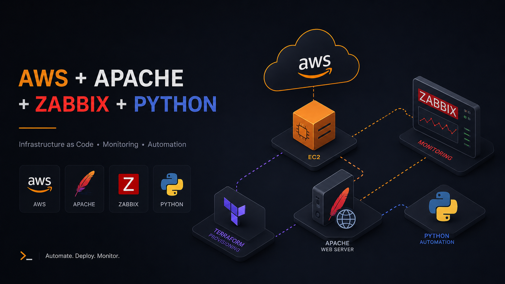

# Deploy AWS Automatizado: Arquitetura, Backup S3 e Monitoramento




## Visão Geral
Este projeto implementa um servidor web Apache hospedado na AWS, monitorado em tempo real pelo Zabbix e com backup diário automatizado para o S3. Todo o acesso às instâncias é feito via AWS Systems Manager, sem nenhuma chave SSH.


## Tecnologias e Ferramentas
- **Cloud Provider:** AWS (EC2, S3, IAM, VPC, Systems Manager)
- **IaC:** Terraform
- **OS & Web Server:** Linux (Ubuntu/Amazon Linux), Apache
- **Automação:** Python, Boto3, Cron
- **Observabilidade:** Zabbix (Server e Agent)

## Projeto em produção:
### Site no ar


### Zabbix - Métricas de CPU/ Discos em tempo real


### AWS Console - Intância EC2 rodando


### AWS Backup funcionando


## Estrutura do Repositório
```
aws-resilient-web-infra/
├── terraform/
│   ├── main.tf
│   ├── variables.tf
│   ├── output.tf
│   ├── providers.tf
│   └── modules/
│       ├── compute/
│       ├── network/
│       ├── security/
│       └── storage/
├── python/
│   └── backup.py
├── website/
│   └── index.html
├── docs/
│   ├── images/
│   ├── apache-setup.md
│   ├── backup-seturp.md
│   ├── setup.md
│   ├── zabbix-setup.md
│   ├── troubleshooting.md
│   └── lessons-learned.md
└── README.md

```
## Pré-requisitos

Conta AWS com permissões de EC2, S3, IAM e SSM
Terraform
AWS CLI configurado
Session Manager Plugin instalado

## Como executar:
Clone o repositório:
```
git clone https://github.com/carolsavio/aws-resilient-web-infra.git
cd aws-resilient-web-infra/terraform
``` 
Configure suas credenciais da AWS
```
aws configure
```
Inicie a infraestrutura em Terraform
```
terraform init
terraform plan
terraform apply
```
Após o `apply`, conecte nas instâncias via SSM e instale o Apache e o Zabbix manualmente conforme documentado em `docs/apache-setup.md` e `docs/zabbix-setup.md`.

---
## Documentação do projeto

Para obter instruções completas de configuração, provisionamento de infraestrutura e etapas de reprodução do projeto, consulte:

➤ [Guia de primeiros passos](./docs/setup.md)

➤ [Guia do Zabbix](/docs/zabbix-setup.md)

➤ [Guia do Apache](/docs/apache-setup.md)

➤ [Guia da automação de Backup](/docs/backup-setup.md)

➤ [Lições Aprendidas](/docs/lessons-learned.md)

➤ [Troubleshooting](/docs/troubleshooting.md)

